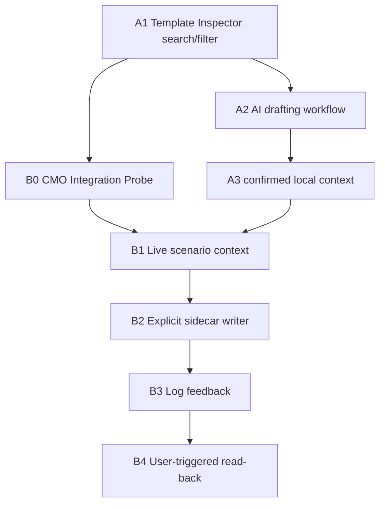

# AI Editor Automation and CMO Integration Roadmap Design

## Goal

Unify the next product direction into two connected tracks:

- Track A: build the Lua script editor into an AI-assisted automation cockpit.
- Track B: connect that cockpit to CMO scenario state and controlled in-game execution paths.

The tracks are not alternatives. Track A creates the safe authoring loop; Track B makes that loop scenario-aware and eventually useful inside CMO. The roadmap keeps CMO file writes and in-game intervention behind explicit capability checks and user approval.

## Current Baseline

The app already has the safety and reference infrastructure needed to begin this transition:

- AI adapter flow with provider profiles and redaction smoke checks.
- `parseAiInterpreterResponse()` safety parsing.
- `isPasteReady === true` as the Lua apply gate.
- Manual prompt-copy fallback.
- Context pruning and hard-blocks for unsafe or incomplete AI output.
- Lazy-split Preset Guide / Template Inspector.
- Template Inspector annotations at `51 / 51`.
- External scenario sidecar root policy; generated sidecars stay out of `public/` and `dist/`.
- Phase 0 CMO Integration Probe design already committed.

The remaining gap is product shape: the user needs one coherent workflow from "I want a CMO behavior" to "safe Lua draft" to "CMO-aware execution / feedback".

## Product Model

The product should behave like a staged workstation:

1. The user chooses or describes an operation.
2. The editor helps pick the right Lua pattern and required CMO facts.
3. The AI drafts or revises Lua using only known context.
4. The user reviews safety state and applies the draft only when paste-ready.
5. Later phases can save, load, or debug against CMO through controlled bridges.

This model intentionally separates authoring confidence from engine execution confidence. A paste-ready Lua draft is still a draft until CMO engine testing confirms it.

## Track A: AI Script Editor Automation

Track A improves the local AI authoring loop without touching CMO files.

### A1. Template Inspector Search and Filter UX

Use the completed `public/template-annotations.json` data to make templates easier to find by task, risk, and required inputs.

Expected behavior:

- Search across file names, categories, APIs, annotation summaries, prerequisites, AI hints, checks, and beginner notes.
- Add quick filters for common work domains: Event, Mission, Unit, DBID / Loadout, GUID, RP / Zone, Weather, Side / Posture, and KeyValue.
- Surface requirement badges such as "needs GUID", "needs DBID", "needs RP names", and "engine test required".
- Keep the feature inside the existing Preset Guide lazy chunk.
- Avoid changes to AI adapter, parser, context pruning, sidecar tooling, or CMO folders.

Why first:

- It uses the newly completed `51 / 51` annotations immediately.
- It gives the user a better front door before deeper automation.
- It is low-risk and should not affect main bundle or CMO safety boundaries.

### A2. AI Drafting Workflow Tightening

Make the editor loop feel like one guided operation rather than separate panels.

Expected behavior:

- Template selection can produce an AI-ready instruction skeleton.
- Missing required facts become explicit ask-back prompts.
- Review panel and chat panel keep reinforcing "draft, not engine-verified final code".
- Working Draft application remains append-only and gated by `isPasteReady`.
- Manual prompt-copy remains visible.

This phase should not introduce persistence beyond existing safe UI state unless separately approved.

### A3. Local Session Context Quality

Improve how the AI authoring surface carries selected template context, recent ask-back facts, and user-confirmed identifiers.

Expected behavior:

- Confirmed Side, Mission, Unit, GUID, DBID, Loadout ID, RP, and Zone values can be marked as source-backed.
- Confirmed values feed the prompt and context pruning preservation rules.
- Unconfirmed values stay as ask-back requirements, not invented defaults.

This phase can prepare the UI for Track B live scenario context, but should still work without CMO integration.

## Track B: CMO Scenario Integration

Track B connects the authoring cockpit to the actual CMO environment. It must proceed more conservatively because it may read logs, inspect scenario state, or eventually write Lua sidecars.

### B0. CMO Integration Probe

Implement the already-approved Phase 0 probe design before any CMO write path.

Expected behavior:

- Discover CMO root, Scenarios root, Logs root, external sidecar root, ExceptionLog, and LuaHistory.
- Produce a capability matrix.
- Use non-mutating checks by default.
- Keep auto-load behavior as a manual CMO verification result, not an assumption.
- Keep generated data out of `public/` and `dist/`.

This is the gate for every later in-game integration step.

### B1. Live Scenario Context Sync

Use external sidecar data and adapter endpoints to bring real scenario context into the editor.

Expected behavior:

- UI reads active scenario context through the adapter, not direct browser filesystem access.
- Side, Mission, Unit, RP, Zone, DBID, Loadout ID, and GUID facts become selectable source-backed values.
- Track A requirement badges can resolve from live scenario facts.
- Context pruning preserves confirmed identifiers.

This phase addresses AI invention risk and improves first-draft accuracy.

### B2. Explicit Sidecar Writer

Allow saving paste-ready Lua drafts into a namespaced CMO scenario sidecar only after capability checks pass.

Expected behavior:

- Save is allowed only when `isPasteReady === true`.
- File names are restricted to a namespace such as `AiAssist_*.lua`.
- No overwrite of user-owned files such as `LuaInit.lua`.
- Path whitelist and traversal rejection are mandatory.
- Backups and retention policy are mandatory.
- Default execution path is an explicit loader snippet or Special Action, not silent automatic execution.

This phase is the first real in-game intervention layer.

### B3. Log Feedback Loop

Read CMO ExceptionLog and LuaHistory to help debug failed Lua runs.

Expected behavior:

- Logs are read-only.
- User and machine-specific path details are redacted in UI summaries.
- The app detects relevant new errors and drafts a follow-up instruction.
- The app never auto-sends to AI without user approval.
- Manual paste fallback remains available.

This phase closes the paste-test-debug loop.

### B4. User-Triggered Read-back

Add semi-live state import using explicit user-triggered CMO export actions.

Expected behavior:

- State export is user-approved or user-triggered.
- CMO sandbox constraints are treated as design facts.
- The app can merge imported state with sidecar context.
- AI answers can refer to the latest imported state only when its timestamp and source are clear.

This is the practical L3 target. Silent real-time daemon behavior should not be the first design.

## Recommended Sequence

Recommended first implementation: A1 Template Inspector Search and Filter UX.

Reasons:

- It is the best immediate use of the completed annotation dataset.
- It improves the local AI authoring loop before CMO integration adds risk.
- It creates UI vocabulary for later live context: required GUID, DBID, Side, RP, and engine-test badges.
- It should stay inside the existing Preset Guide lazy chunk.

B0 should follow soon after A1, because every in-game write or log bridge depends on capability facts.

## Branch Points

After A1:

- If Template Inspector remains under bundle watch lines, continue to A2.
- If PresetGuide chunk grows too much, do a small UI/headroom pass before A2.

After B0:

- If Scenarios root is unreadable, pause Track B and keep improving Track A.
- If Logs root is missing but Scenarios root works, proceed to B1 but defer B3.
- If write access is uncertain, B2 must stay explicit-loader-only and no automated write probe is allowed without approval.
- If auto-load fails, never design around automatic `.lua` loading; use loader snippets or Special Actions.

Before B2:

- Confirm the filename namespace and backup policy.
- Confirm whether the target is a disposable scenario copy or a live working scenario.
- Confirm Kimi QA scope for path traversal, no-overwrite, and backup behavior.

## Safety Invariants

- `isPasteReady === true` remains the only apply/save gate.
- Prompt-copy and request-copy fallbacks remain available.
- AI responses are never treated as engine-verified final code.
- No generated sidecar data returns to `public/` or `dist/`.
- No automatic AI send from logs or state import.
- No `.scen` modification.
- No broad scenario folder writes.
- No raw API key, Bearer, Authorization, or `sk-` persistence.
- All in-game writes require namespace, path whitelist, no-overwrite rules, and user-visible intent.

## QA Strategy

Track A QA should emphasize UI behavior and bundle containment:

- `npm run lint`
- `npm run build`
- `npm run smoke:ai-adapter`
- Template Inspector search/filter static checks.
- Main JS under `400 kB`.
- Main CSS under `60 kB`.
- Existing lazy chunk boundaries preserved.
- Prompt-copy and `isPasteReady` gates unchanged.

Track B QA should emphasize filesystem and safety boundaries:

- `npm run verify:release`
- Any new smoke script for the new endpoint or tool.
- Path traversal rejection.
- No generated data under `public/`, `dist/`, or project-local sidecar directories.
- No writes during probe phases.
- No auth leakage in adapter smoke.

## Implementation Planning Rule

Each roadmap item gets its own design or implementation plan. Do not combine A1 and B0 into one product commit. They can be sequenced closely, but they test different risks:

- A1 tests whether the AI editor can guide users better.
- B0 tests whether the machine can safely support CMO integration.

The next plan should be A1 unless the user explicitly prioritizes CMO environment probing first.

## Next Recommended Step

Create the A1 implementation plan for Template Inspector Search and Filter UX. The first implementation should be small:

- Extend `resourceSearchText()` to include annotation text.
- Add quick filter state inside `TemplateLibrary.jsx`.
- Derive requirement badges from annotation text and resource metadata.
- Add focused CSS inside `PresetGuide.css`, preserving the lazy split.
- Create a Kimi QA directive for search/filter behavior, bundle size, and AI safety invariants.
