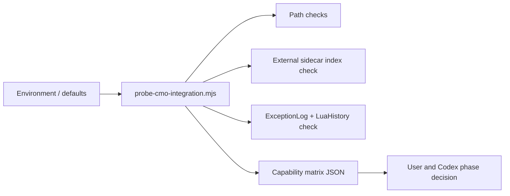

# CMO Integration Probe Design

## Goal

Add a Phase 0 design gate before any in-game CMO automation work. The probe determines what this local machine can safely support: CMO install discovery, scenario folder access, log read-back, LuaHistory availability, existing sidecar root health, and whether scenario-folder Lua auto-load is a real engine behavior or only a scenario authoring pattern.

This phase does not implement live object sync, scenario writes, log feedback, or state export. It only produces a capability matrix that later phases can trust.

## Context

The project is moving from a safe manual AI assistant into deeper CMO integration. The current stable baseline already has parser safety, `isPasteReady` gating, prompt-copy fallback, external scenario sidecars, release verification, and Template Inspector annotation coverage. The next risk is not bundle size or prompt quality; it is assuming CMO runtime behavior that has not been proven on the user's machine.

Phase 0 exists to avoid building Phase 1 or Phase 2 on guesses. In particular:

- Generated sidecars must not be mirrored back into `public/` or `dist/`.
- Scenario folder writes must not happen until path and permission behavior are explicit.
- Automatic Lua loading must be treated as unverified until the user confirms it in CMO.
- ExceptionLog and LuaHistory should both be considered for later feedback loops.

## Scope

Phase 0 covers design and later implementation of a read-mostly integration probe.

In scope:

- Discover configured or likely CMO root, Scenarios root, and Logs root.
- Verify external sidecar root and index presence.
- Inspect whether recent `ExceptionLog_*.txt` and `LuaHistory_*` files are present and readable.
- Report scenario folder access with non-mutating checks.
- Produce a capability matrix for downstream phases.
- Document a user-run manual CMO auto-load experiment.
- Keep all results local and non-destructive.

Out of scope:

- Writing Lua into any CMO scenario folder.
- Modifying `.scen` files.
- Creating generated files under `public/` or `dist/`.
- Starting automatic AI calls.
- Adding object picker UI, sidecar writer UI, log follow-up UI, or live state panels.
- Introducing a new test framework.

## Recommended Approach

Use a CLI-first probe plus a later optional adapter endpoint.

The first implementation should be a small Node tool, likely `tools/probe-cmo-integration.mjs`, because it can run before any UI or server changes. The tool should read configuration, perform safe filesystem checks, and print a JSON capability matrix. Once the matrix shape is stable, a later implementation slice may expose it through the local adapter for a Settings status card.

This is preferable to starting with UI because the risky facts are filesystem and CMO-runtime facts, not presentation problems. It also avoids increasing the main bundle while the integration assumptions are still soft.

## Configuration

The probe should support explicit configuration first and safe defaults second.

Candidate inputs:

- `CMO_ROOT`
- `CMO_SCENARIOS_ROOT`
- `CMO_LOGS_ROOT`
- `CMO_SCENARIO_SIDECAR_ROOT`

Defaults may point to the user's known personal Windows layout, but every default must be reported as a guess. The final matrix should record whether each path came from an explicit environment value or from a default guess.

The existing external sidecar root policy remains canonical: generated sidecar data belongs outside the app bundle. Phase 0 must not revive `public/scenario-scan-samples` as a generated-data location.

## Capability Matrix

The probe output should be stable JSON with these top-level sections:

```json
{
  "version": 1,
  "checkedAt": "ISO-8601 timestamp",
  "paths": {},
  "sidecars": {},
  "logs": {},
  "permissions": {},
  "manualChecks": {},
  "phaseReadiness": {},
  "warnings": []
}
```

Required fields:

- `paths.cmoRoot`: existence and source.
- `paths.scenariosRoot`: existence, readability, and source.
- `paths.logsRoot`: existence, readability, and source.
- `sidecars.externalRoot`: existence and source.
- `sidecars.index`: presence, scenario count if readable, and parse status.
- `logs.exceptionLog`: latest matching file, readability, and last modified time.
- `logs.luaHistory`: latest matching file, readability, and last modified time.
- `permissions.scenariosWriteAccess`: non-mutating access check only.
- `manualChecks.luaAutoLoad`: `unknown`, `passed`, `failed`, or `not-run`.
- `phaseReadiness.phase1LiveContext`: `ready`, `blocked`, or `needs-review`.
- `phaseReadiness.phase2SidecarWriter`: `ready`, `blocked`, or `needs-review`.

The matrix should be conservative. Missing Logs should not block Phase 1, but missing Scenarios root should. Write access uncertainty should block Phase 2 until resolved.

## Manual CMO Auto-Load Check

Phase 0 cannot prove scenario-folder Lua auto-load from Node alone. The spec should therefore include a user-run manual check:

1. Create a temporary test scenario or use a disposable copy.
2. Place a harmless namespaced Lua file such as `AiAssist_AutoloadProbe.lua` in the scenario folder.
3. The script should only set or print a marker, for example `ScenEdit_SetKeyValue("AiAssist_AutoloadProbe", "1")`.
4. Load or reload the scenario in CMO.
5. Confirm whether the marker appears without explicit user execution.
6. Remove the probe file after the test.

The implementation should not automate this write in the first slice. If later automated, it must require explicit user approval and use only a disposable scenario or temporary namespace.

## Data Flow



Phase 1 and Phase 2 consume the matrix only after the user approves the result. No later phase should infer capabilities from hardcoded paths alone.

## Safety Rules

- No writes to `.scen`, scenario folders, CMO install folders, or generated public assets.
- No deletion, pruning, or migration.
- No path traversal acceptance in any future endpoint.
- No raw API keys, Bearer tokens, or Authorization values in probe output.
- Absolute paths may be printed locally for the user, but future UI or adapter responses should redact user-specific segments unless explicitly expanded.
- `isPasteReady === true` remains the only apply/save gate for later Lua-writing phases.
- Manual prompt-copy fallback remains unchanged.
- Automatic AI send remains forbidden in all later log-feedback designs unless the user explicitly approves a send action.

## Readiness Rules

Phase 1 can proceed when:

- Scenarios root exists and is readable.
- External sidecar root exists or can be configured.
- The probe can identify where active scenario summaries should be read from without using `public/`.

Phase 2 can proceed when:

- Phase 1 is not blocked.
- Scenarios root write behavior is explicitly understood.
- The user chooses a sidecar execution mode: explicit loader command first, auto-load only if manually proven.

Phase 3 can proceed when:

- Logs root exists and at least one of ExceptionLog or LuaHistory is readable, or the user accepts a degraded manual paste workflow.

Phase 4 can proceed only after:

- Phase 1 provides reliable object context.
- Phase 2 provides a controlled sidecar deployment path.
- The design treats read-back as user-approved or user-triggered first, not silent real-time automation.

## Verification Plan

Design-doc verification:

- Confirm this spec has no placeholders, TODOs, or ambiguous implementation commands.
- Confirm the spec does not authorize product-code changes.
- Confirm the spec preserves the external sidecar root policy and rejects `public/` generated-data mirrors.

Future implementation verification:

```powershell
npm run verify:release
```

Additional smoke target for the later implementation:

```powershell
npm run smoke:cmo-integration-probe
```

The smoke should validate matrix shape, safe handling of missing paths, and no writes to CMO folders. If an adapter endpoint is added later, include path traversal negative tests and redaction checks.

## QA Handoff

When Phase 0 implementation starts, Kimi should verify:

- Product code changed only in the approved Phase 0 files.
- No generated data appears in `public/`, `dist/`, or project-local sidecar folders.
- Probe output includes CMO root, Scenarios root, Logs root, sidecar root, ExceptionLog, LuaHistory, and readiness fields.
- Missing or unreadable paths degrade to warnings instead of crashes.
- No scenario file, `.scen`, Lua file, or CMO install file is created or modified.
- `npm run verify:release` passes.
- Any new smoke script passes.

## Open Decisions Before Implementation

- Whether Phase 0 should ship as CLI-only first, or CLI plus adapter endpoint.
- Whether path defaults live in environment variables only, or also in a checked-in documented local config template.
- Whether the manual auto-load result should be recorded in a local JSON file or only in a handoff note.
- Whether the first implementation plan should include a Settings status card, or defer UI until after the CLI probe proves useful.

## Recommendation

Start with CLI-only Phase 0. It is the smallest useful slice, it protects the recent public/dist sidecar policy, and it gives us a hard capability matrix before touching in-game automation. After the user runs or reviews the matrix, create the implementation plan for Phase 1 or Phase 2 based on facts instead of hope.
